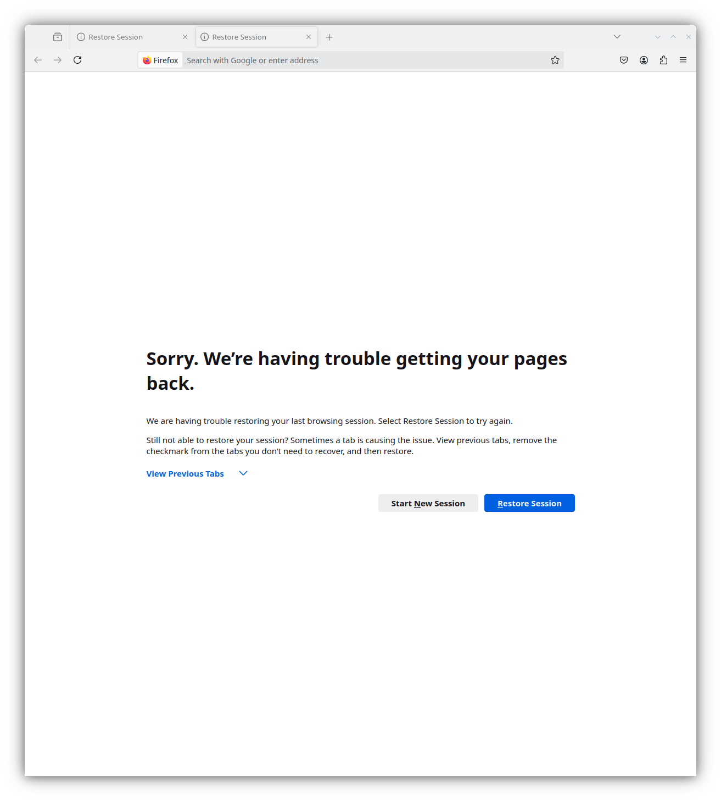

# 第一章

this is c01


```sh
$ curl -H 'Accept: text/html' -H 'Accept-Language: zh-CN' http://localhost:8080

================================
Request 21
================================

GET / HTTP/1.1
Host: localhost:8080
Accept: text/html
Accept-Language: zh-CN
User-Agent: curl/8.10.1
```


aaaaa


